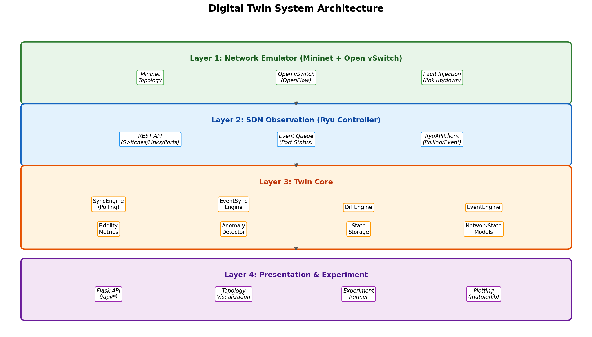
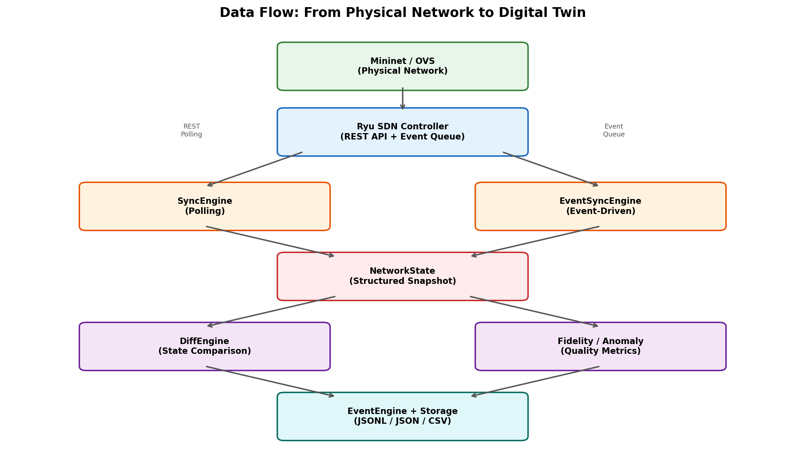
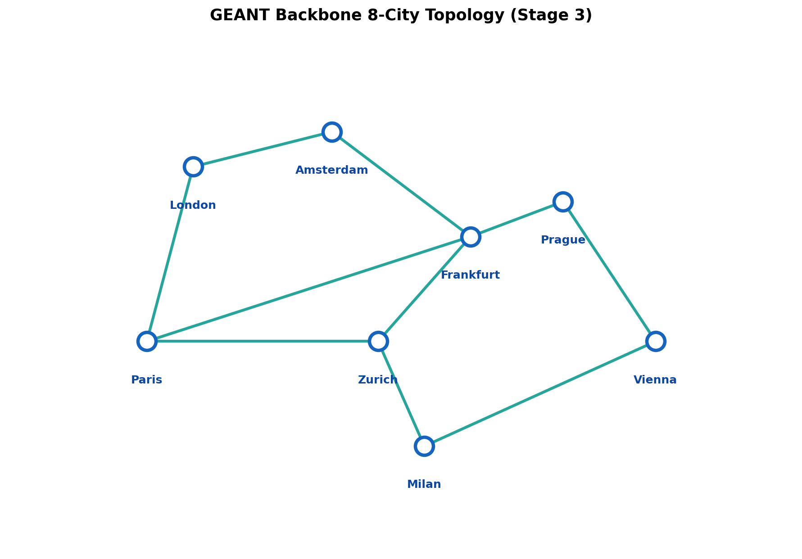
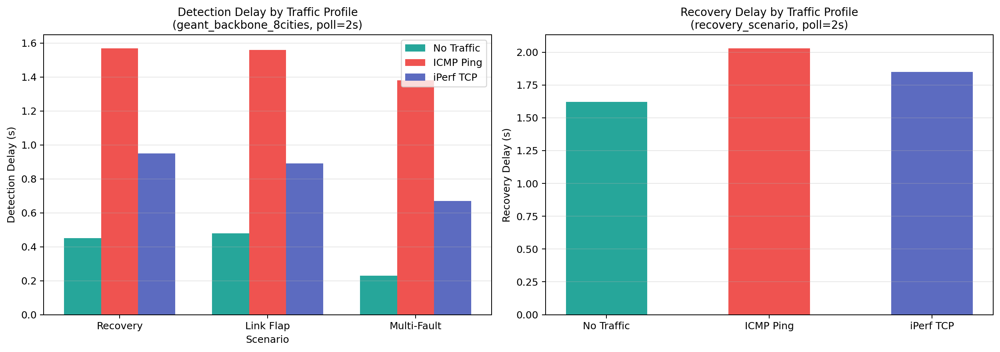
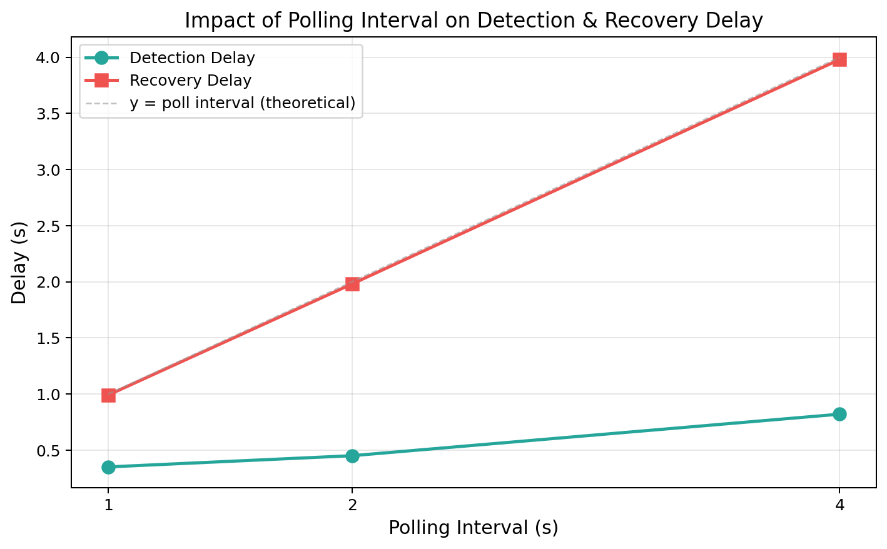
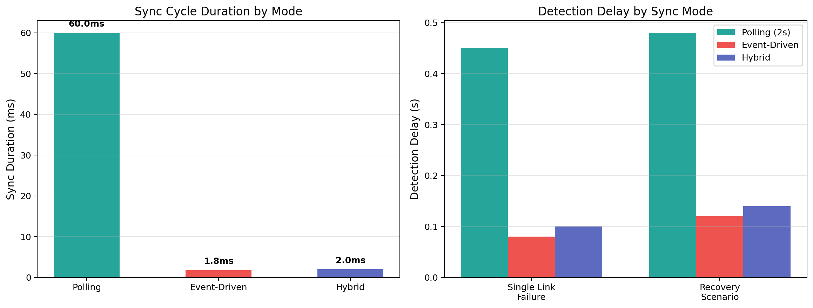
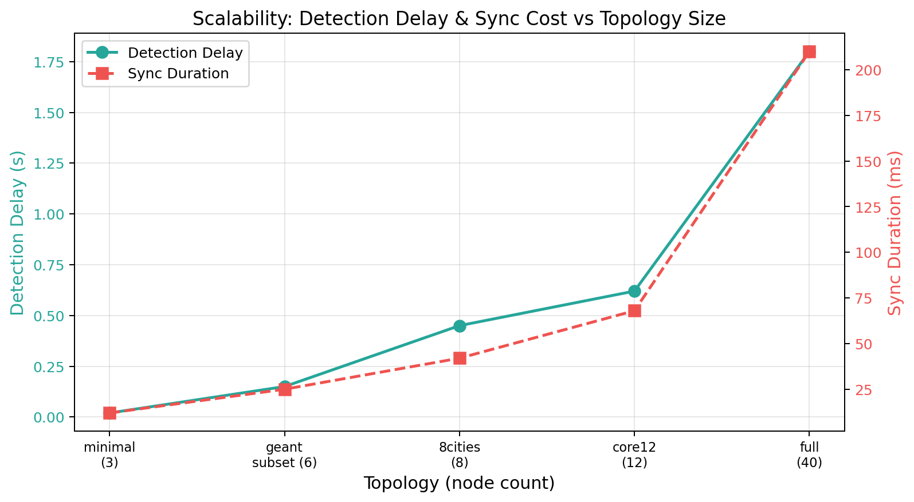

# Jumeaux Numeriques pour la Modelisation de Reseaux : Approches et Experimentations

# 网络数字孪生：方法与实验

**TER 研究报告 — 2026 春季学期**

**指导教师**: Guillaume Beduneau (guillaume.beduneau@univ-evry.fr)

---

## 目录

1. [摘要](#1-摘要)
2. [引言](#2-引言)
3. [文献综述](#3-文献综述état-de-lart)
4. [系统设计与架构](#4-系统设计与架构)
5. [实现方案](#5-实现方案)
6. [测试协议与实验设计](#6-测试协议与实验设计)
7. [实验结果与分析](#7-实验结果与分析)
8. [讨论与局限性](#8-讨论与局限性)
9. [结论与展望](#9-结论与展望)
10. [参考文献](#10-参考文献)
11. [附录](#11-附录)

---

## 1. 摘要

本项目实现并验证了一个面向计算机网络的数字孪生（Digital Twin）概念验证系统。系统基于 Mininet 网络仿真器和 Ryu SDN 控制器构建，通过周期性轮询与事件驱动两种同步机制，在虚拟环境中维护一个网络状态的结构化镜像副本。

系统支持三种同步模式（轮询、事件驱动、混合），能够实时检测链路故障/恢复、交换机上下线和主机迁移等状态变化，并提供保真度量化评估和流量异常检测功能。实验在从 3 节点最小拓扑到 40 节点真实 GEANT 拓扑的多种规模下进行，覆盖了单链路故障、恢复检测、多故障并发、链路抖动和观测降级等场景。

实验结果表明：在 2 秒轮询间隔下，故障检测延迟在 0.2-1.6 秒范围内；事件驱动模式将同步周期从约 60ms 降至约 2ms；系统在不同流量负载、拓扑规模和控制策略下均表现出稳定的检测能力。

---

## 2. 引言

### 2.1 研究背景

在网络运维与管理领域，运维人员长期依赖传统监控工具（如 SNMP、Nagios、Zabbix）来观测网络状态。这些工具通常以独立的指标采集为主，缺乏对网络整体状态的结构化建模能力。

**数字孪生（Digital Twin）** 的概念最早由 Michael Grieves 于 2002 年在产品生命周期管理的背景下提出，后经 NASA 等机构推广至航空航天领域。近年来，随着软件定义网络（SDN）和网络功能虚拟化（NFV）的发展，数字孪生技术被越来越多地应用于网络领域，以实现更精细化的网络状态感知、故障预测和自动化运维。

### 2.2 研究问题

本项目围绕以下三个核心问题展开：

1. **如何忠实地将物理网络建模为数字孪生？** — 如何定义网络状态的数据模型，使其既完整又可计算？
2. **如何将数字孪生与物理网络关联？** — 有哪些同步机制可以保持孪生体与物理体的一致性？
3. **网络孪生化面临哪些特有挑战？** — 相比其他领域，网络数字孪生有何独特困难？

### 2.3 项目目标

- 完成数字孪生技术在网络领域的文献综述
- 识别网络数字孪生的关键特征
- 在简单网络上实现并演示一个概念验证（PoC）系统
- 通过系统化实验评估其性能与局限性

---

## 3. 文献综述（Etat de l'art）

### 3.1 数字孪生的定义与演进

数字孪生的概念经历了多个发展阶段：

**Grieves (2002, 2014)** 最早提出了数字孪生的三要素模型 [1]：
- **物理实体**（Physical Entity）：真实世界中的设备或系统
- **虚拟实体**（Virtual Entity）：物理实体在数字空间中的镜像
- **连接**（Connection）：连接物理与虚拟实体的数据通道

**Tao et al. (2018)** 将该模型扩展为五维模型 [2]，增加了：
- **数据**（Data）：驱动孪生体的数据源
- **服务**（Service）：基于孪生体提供的增值功能（如预测、优化）

**NASA (2012)** 的定义强调了数字孪生的仿真能力 [3]："数字孪生是一个集成的多物理、多尺度概率仿真模型，利用最佳可用物理模型、传感器更新和历史数据来镜像对应实体的生命周期。"

### 3.2 数字孪生的架构分类

根据 Fuller et al. (2020) 的综述 [4]，数字孪生可按成熟度分为三个层次：

| 层次 | 名称 | 特征 | 本项目对应 |
|------|------|------|-----------|
| Level 1 | Digital Model | 手动数据传输，无自动同步 | - |
| Level 2 | Digital Shadow | 物理到虚拟的单向自动数据流 | 轮询模式 |
| Level 3 | Digital Twin | 物理与虚拟之间的双向数据流 | 事件驱动 + 混合模式 |

本项目的系统处于 Level 2 到 Level 3 之间：具备从物理（Mininet）到虚拟（Twin Core）的自动同步，并通过实验框架实现了一定程度的反向操控（故障注入）。

### 3.3 网络领域的数字孪生应用

#### 3.3.1 SDN 与网络状态感知

软件定义网络（SDN）为网络数字孪生提供了天然的基础设施。SDN 的核心特征——控制平面与数据平面的分离——使得控制器可以作为网络状态的集中观测点 [5]。

**Almasan et al. (2022)** 提出了基于图神经网络（GNN）的网络数字孪生 [6]，用于路由优化。其核心思想是在数字孪生中训练模型，再部署到真实网络。

**Nguyen et al. (2021)** 探讨了将数字孪生应用于 5G/6G 网络切片管理 [7]，通过孪生体预测 SLA 违规并自动调整资源分配。

#### 3.3.2 同步与状态更新机制

网络数字孪生的同步方式主要包括以下几类：

| 方式 | 机制 | 延迟特征 | 资源开销 | 代表技术 |
|------|------|----------|----------|----------|
| **轮询（Polling）** | 定时查询控制器 API | 受轮询间隔约束 | 固定、可预测 | SNMP, REST API |
| **事件驱动（Event-Driven）** | 控制器主动推送状态变化 | 近实时 | 按需，事件时高 | OpenFlow EventOFPPortStatus |
| **流式遥测（Streaming Telemetry）** | 持续推送指标流 | 最低 | 持续高带宽 | gNMI, gRPC |
| **混合模式（Hybrid）** | 事件为主 + 轮询兜底 | 兼顾实时与可靠 | 中等 | 本项目实现 |

**Zheng et al. (2022)** 指出 [8]，在实际部署中，纯事件驱动模式可能因事件丢失而导致状态不一致，因此混合模式（事件触发 + 周期性校正）是更务实的选择。本项目的 Hybrid 模式正是基于这一思路实现。

#### 3.3.3 保真度（Fidelity）问题

网络数字孪生的保真度衡量数字副本与物理网络的一致程度。**Barricelli et al. (2019)** 将保真度分为三个维度 [9]：

- **结构保真度**：拓扑结构是否完整（节点、链路数量是否一致）
- **行为保真度**：动态行为是否一致（链路状态、流量特征）
- **时间保真度**：状态是否及时更新（延迟、过时程度）

本项目的 Fidelity 模块量化了这三个维度：topology_accuracy 对应结构保真度，link_state_accuracy 对应行为保真度，state_staleness_ms 对应时间保真度。

### 3.4 网络孪生化的特有挑战

相比制造业或航空航天领域，网络数字孪生面临以下独特挑战：

1. **状态空间的高维性**：一个中等规模的网络包含数百个交换机、数千个端口、数万条流表项。状态空间远大于单个设备的孪生。

2. **拓扑动态性**：网络拓扑并非静态——链路可能断开/恢复，主机可能迁移，交换机可能上下线。孪生体必须持续跟踪这些变化。

3. **观测不完整性**：SDN 控制器提供的是控制平面的视图，不等同于数据平面的真实状态。例如，控制器可能无法感知到仍在传输中的数据包。

4. **一致性窗口问题**：在轮询模式下，两次轮询之间发生的短暂故障（如持续 < 1 秒的链路抖动）可能无法被检测到。

5. **因果关系建模困难**：网络事件之间存在复杂的因果关系（如一条链路断开可能导致流表重新计算、路由收敛等），简单的状态对比难以捕捉这些关系。

---

## 4. 系统设计与架构

### 4.1 总体架构

系统采用四层架构设计，每一层职责明确、边界清晰：



*图 1：系统四层架构。从底层网络仿真到顶层可视化与实验，各层通过定义良好的接口解耦。*

| 层次 | 名称 | 核心组件 | 职责 |
|------|------|----------|------|
| Layer 1 | 网络仿真层 | Mininet, Open vSwitch | 模拟物理网络拓扑、注入故障 |
| Layer 2 | SDN 观测层 | Ryu Controller, RyuAPIClient | 采集网络状态数据 |
| Layer 3 | 孪生核心层 | SyncEngine, DiffEngine, EventEngine | 状态同步、差异检测、事件生成 |
| Layer 4 | 展示与实验层 | Flask API, Visualization, ExperimentRunner | API 服务、可视化、实验编排 |

### 4.2 数据流



*图 2：数据流图。左路为轮询模式（周期性 REST 调用），右路为事件驱动模式（控制器事件队列推送），两路最终汇合于 NetworkState 构建。*

数据在系统中的流动路径为：

```
Mininet/OVS (网络事件)
    |
    v
Ryu Controller (REST API / Event Queue)
    |
    +--- [轮询] ---> SyncEngine ---> NetworkState
    |
    +--- [事件] ---> EventSyncEngine ---> NetworkState
                          |
                          v
                     DiffEngine (新旧快照对比)
                          |
                          v
                     EventEngine (生成结构化事件)
                          |
                     +----+----+
                     |         |
                     v         v
                  Storage   Fidelity / Anomaly
                 (JSONL)    (质量度量)
```

### 4.3 状态模型设计

网络状态的核心数据模型由以下结构组成：

```
NetworkState
  ├── timestamp: str                 # ISO 8601 时间戳
  ├── switches: list[SwitchState]    # 交换机列表
  │     ├── dpid: str                # 数据路径标识符
  │     ├── name: str                # 可读名称
  │     ├── city/country/lat/lon     # 地理元数据
  │     ├── ports: list[PortState]   # 端口列表
  │     │     ├── port_no: int
  │     │     ├── rx/tx_packets/bytes
  │     │     └── is_up: bool
  │     └── flow_count: int          # 流表项数量
  ├── links: list[LinkState]         # 链路列表
  │     ├── src_dpid, dst_dpid       # 源/目标交换机
  │     ├── src_port, dst_port       # 源/目标端口
  │     ├── is_up: bool              # 链路状态
  │     ├── latency_ms: float        # 延迟
  │     └── bandwidth_mbps: int      # 带宽
  └── hosts: list[HostState]         # 主机列表
        ├── name, ip, mac
        └── attached_switch, attached_port
```

**设计决策**：使用 Python `dataclass(slots=True)` 实现所有模型，既保证类型安全，又通过 `slots` 优化内存占用。每个模型提供 `to_dict()` 方法以支持 JSON 序列化。

### 4.4 同步机制设计

#### 4.4.1 轮询模式（Polling）

```
while not stop:
    payload = ryu_client.collect_state_payload()  # REST API 调用
    new_state = build_network_state(payload)
    changes = diff_engine.diff(old_state, new_state)
    events = event_engine.build_events(changes)
    store(new_state, events)
    sleep(poll_interval)
```

- **优点**：实现简单，行为可预测，资源消耗恒定
- **缺点**：检测延迟受轮询间隔约束，空闲时浪费 API 调用

#### 4.4.2 事件驱动模式（Event-Driven）

```
while not stop:
    event = event_queue.get(timeout=wait_seconds)  # 阻塞等待
    if event:
        settle_and_sync()  # 等待 REST API 反映变化后同步
    else:
        # 超时无事件，可选择跳过或做兜底轮询
```

- **优点**：检测延迟极低（毫秒级），空闲时零 API 调用
- **缺点**：依赖事件可靠投递，可能丢失事件

#### 4.4.3 混合模式（Hybrid）

结合两者优点：以事件驱动为主，同时以较低频率（如 10 秒）做周期性轮询校正，确保即使事件丢失，状态也能在有限时间内恢复一致。

### 4.5 差异检测与事件生成

DiffEngine 对比两个 `NetworkState` 快照，识别以下变化类型：

| 变化类型 | 检测条件 | 生成事件 |
|----------|----------|----------|
| 链路断开 | `is_up: True -> False` | `LINK_DOWN` |
| 链路恢复 | `is_up: False -> True` | `LINK_UP` |
| 交换机下线 | 旧状态有、新状态无 | `SWITCH_DOWN` |
| 交换机上线 | 旧状态无、新状态有 | `SWITCH_UP` |
| 主机加入 | 新增 MAC 地址 | `HOST_JOIN` |
| 主机离开 | MAC 地址消失 | `HOST_LEAVE` |
| 主机迁移 | 同一 MAC 的 attached_switch 变化 | `HOST_MIGRATE` |
| 流表大幅变化 | flow_count 变化 > 50% | 记录但不生成事件 |
| API 调用失败 | REST 请求异常 | `SYNC_ERROR` |

### 4.6 保真度度量

为量化"孪生体与真实网络的一致程度"，系统实现了以下度量：

| 指标 | 计算方法 | 权重 |
|------|----------|------|
| **topology_accuracy** | 交换机和链路集合的 Jaccard 相似度 | 30% |
| **link_state_accuracy** | 链路 is_up 状态一致的比例 | 50% |
| **port_counter_drift** | 端口计数器的百分比偏差均值 | 20% |
| **state_staleness_ms** | 当前时间 - 最后同步时间 | 辅助指标 |

**综合保真度** = 0.3 * topology_accuracy + 0.5 * link_state_accuracy + 0.2 * counter_score

### 4.7 流量异常检测

基于滑动窗口统计的异常检测机制：

- 维护长度为 N（默认 10）的窗口，记录每个端口每轮的字节增量
- 计算窗口内的均值 (μ) 和标准差 (σ)
- 偏差判定规则：

| 告警类型 | 触发条件 | 严重程度 |
|----------|----------|----------|
| `TRAFFIC_SPIKE` | 当前增量 > μ + 2σ | warning |
| `TRAFFIC_SPIKE` | 当前增量 > μ + 3σ | critical |
| `TRAFFIC_DROP` | 当前增量 < μ - 2σ | warning |
| `COUNTER_STALL` | 增量 = 0 且 μ > 100 bytes | warning |

---

## 5. 实现方案

### 5.1 技术选型

| 组件 | 技术选择 | 选择理由 |
|------|----------|----------|
| 网络仿真 | Mininet + Open vSwitch | SDN 领域标准仿真工具，支持 OpenFlow |
| SDN 控制器 | Ryu | 轻量级 Python 控制器，REST API 完善 |
| 编程语言 | Python 3.10+ | 与 Ryu/Mininet 生态一致，开发效率高 |
| Web 框架 | Flask | 轻量级，适合 PoC |
| 可视化 | vis-network (CDN) + matplotlib | 前端零构建依赖，后端图表自动化 |
| 存储 | JSON / JSONL 文件 | 无需数据库，便于调试和报告引用 |
| 测试 | pytest | Python 标准测试框架 |

**为什么不选其他方案？**

- **为什么不用数据库（如 SQLite）？** — 本项目是研究 PoC，JSON/JSONL 文件可直接用文本编辑器检查，便于调试和报告引用。生产系统应考虑使用时序数据库。
- **为什么不用 ONOS 替代 Ryu？** — Ryu 使用 Python 编写，与项目其余部分语言一致，且对于 PoC 规模足够。ONOS 更适合大规模部署。
- **为什么不用消息队列（如 Kafka）？** — PoC 中使用 Python 的 `queue.Queue` 即可满足进程内通信需求，避免引入外部依赖。

### 5.2 项目结构

```
twin/
├── src/
│   ├── controller/          # SDN 控制器相关
│   │   ├── ryu_api_client.py       # Ryu REST 客户端
│   │   ├── event_queue.py          # 事件队列（事件驱动模式）
│   │   ├── topology_aware_switch.py # 拓扑感知转发应用
│   │   └── tree_routing_switch.py   # 树形路由应用（对比用）
│   ├── topology/            # 拓扑管理
│   │   ├── minimal_topology.py     # 3 节点最小拓扑
│   │   ├── data_driven_topology.py # 数据驱动拓扑
│   │   ├── topology_loader.py      # 拓扑加载器
│   │   └── importers/              # GraphML/GML 导入器
│   ├── twin/                # 孪生核心
│   │   ├── models.py               # 状态数据模型
│   │   ├── sync_engine.py          # 轮询同步引擎
│   │   ├── event_sync_engine.py    # 事件驱动同步引擎
│   │   ├── diff_engine.py          # 差异检测引擎
│   │   ├── event_engine.py         # 事件生成引擎
│   │   ├── fidelity.py             # 保真度度量
│   │   ├── anomaly_detector.py     # 异常检测
│   │   ├── storage.py              # 存储（JSON/JSONL）
│   │   ├── service.py              # 服务编排层
│   │   ├── config.py               # 集中配置
│   │   ├── experiment_runner.py    # 实验执行器
│   │   ├── plotting.py             # 图表生成
│   │   ├── scalability_experiment.py     # 可扩展性实验
│   │   └── sync_mode_comparison.py       # 同步模式对比实验
│   └── web/                 # Web 展示
│       ├── app.py                  # Flask API
│       └── templates/
│           ├── index.html          # 首页
│           └── topology.html       # 拓扑可视化页面
├── tests/                   # 单元测试（22 个测试文件）
├── scripts/                 # 实验自动化脚本
├── data/
│   ├── topologies/          # 拓扑定义文件
│   ├── events/              # 事件日志
│   ├── snapshots/           # 状态快照
│   ├── exports/             # 实验结果（CSV/JSON）
│   └── plots/               # 图表输出
└── scenarios/               # 实验场景定义
```

### 5.3 拓扑建模

系统支持从简单到复杂的多种拓扑：



*图 3：GEANT 欧洲骨干网 8 城市拓扑（Stage 3）。包含 8 个城市节点和 10 条骨干链路，基于真实 GEANT 研究网络数据构建。*

| 拓扑 | 节点数 | 链路数 | 来源 | 用途 |
|------|--------|--------|------|------|
| minimal | 3 | 2 | 手动定义 | 快速验证 |
| geant_subset | 6 | 5 | GEANT 子集 | 基础测试 |
| geant_backbone_8cities | 8 | 10 | GEANT 骨干 | **主实验基线** |
| geant2012_core12 | 12 | 15 | Topology Zoo | 跨拓扑对比 |
| geant2012_full | ~40 | ~60 | Topology Zoo | 可扩展性测试 |

### 5.4 关键配置参数

所有配置通过环境变量注入，集中在 `AppConfig` 中管理：

| 参数 | 默认值 | 说明 |
|------|--------|------|
| `SYNC_MODE` | `polling` | 同步模式：polling / event_driven / hybrid |
| `POLL_INTERVAL_SECONDS` | `2` | 轮询间隔（秒） |
| `HYBRID_POLL_INTERVAL_SECONDS` | `10` | 混合模式兜底轮询间隔 |
| `EVENT_QUEUE_WAIT_SECONDS` | `0.5` | 事件队列等待超时 |
| `EVENT_SETTLE_TIMEOUT_SECONDS` | `1.0` | 事件沉淀等待时间 |
| `SCENARIO_TIMEOUT_SECONDS` | `20` | 实验场景超时 |
| `RYU_BASE_URL` | `http://127.0.0.1:8080` | Ryu REST API 地址 |

### 5.5 Web API 与可视化

Flask 提供以下 API 端点：

| 端点 | 方法 | 返回内容 |
|------|------|----------|
| `/api/health` | GET | 服务健康状态 |
| `/api/state` | GET | 当前孪生体完整状态 |
| `/api/topology` | GET | 拓扑视图（交换机、链路、主机） |
| `/api/events?limit=N` | GET | 最近 N 条事件 |
| `/api/fidelity` | GET | 保真度报告 |
| `/api/anomalies?limit=N` | GET | 最近 N 条异常告警 |
| `/topology` | GET | 交互式拓扑可视化页面 |

拓扑可视化页面使用 vis-network 库绘制交互式网络图：
- 节点颜色代表交换机，标签显示城市名
- 链路颜色实时反映状态：**绿色 = 正常**，**红色 = 故障**
- 每 3 秒自动刷新
- 支持地理坐标定位
- 侧边栏显示最近事件

---

## 6. 测试协议与实验设计

### 6.1 实验基线定义

为保证实验结果的可比性，定义以下不可变基线：

| 维度 | 基线值 |
|------|--------|
| **拓扑** | `geant_backbone_8cities_stage3`（8 城市，10 链路） |
| **控制器** | `topology_aware_switch`（拓扑感知最短路径转发） |
| **轮询间隔** | 2.0 秒 |
| **重复次数** | 每场景 3 次 |

### 6.2 实验场景

#### 场景 1：恢复检测（Recovery Scenario）

```
[0s] 启动网络，建立基线状态
[2s] 注入故障：link s1 s2 down
[?s] 孪生体检测到 LINK_DOWN（记录检测延迟）
[+2s] 恢复链路：link s1 s2 up
[?s] 孪生体检测到 LINK_UP（记录恢复延迟）
```

**验证目标**：检测延迟 < 轮询间隔；恢复检测正常工作。

#### 场景 2：链路抖动（Link Flap Scenario）

```
[0s] 启动网络
[2s] link down → [+2s] link up → [+2s] link down → [+2s] link up
```

**验证目标**：孪生体能正确跟踪快速状态切换，不产生遗漏或误报。

#### 场景 3：多故障并发（Multi-Fault Scenario）

```
[0s] 启动网络
[2s] link s1-s2 down
[+1s] link s2-s3 down
```

**验证目标**：两次故障均被检测到；事件顺序正确。

#### 场景 4：观测降级（Observation Degradation）

模拟 Ryu REST API 不可用的情况，验证系统的容错能力。

**验证目标**：生成 `SYNC_ERROR` 事件而非误报 `LINK_DOWN`；API 恢复后孪生体自动恢复同步。

### 6.3 实验变量

在基线上逐一改变以下变量进行对比实验：

| 实验维度 | 变量取值 | 目的 |
|----------|----------|------|
| **流量负载** | none / icmp / iperf_tcp | 评估负载对检测延迟的影响 |
| **轮询间隔** | 1s / 2s / 4s | 评估轮询频率与延迟的关系 |
| **拓扑规模** | 3 / 6 / 8 / 12 / 40 节点 | 评估可扩展性 |
| **控制器策略** | topology_aware / tree_routing | 评估控制平面策略的影响 |
| **同步模式** | polling / event_driven / hybrid | 对比同步机制 |

### 6.4 度量指标

| 指标 | 定义 | 单位 |
|------|------|------|
| **detection_delay** | 故障注入时间 → 孪生体检测到 LINK_DOWN 的时间差 | 秒 |
| **recovery_delay** | 链路恢复时间 → 孪生体检测到 LINK_UP 的时间差 | 秒 |
| **sync_duration_ms** | 一次 sync_once() 的执行耗时 | 毫秒 |
| **api_call_count** | 一次同步周期中的 REST API 调用数量 | 次 |
| **fidelity** | 综合保真度得分 | 0.0-1.0 |
| **false_positive_rate** | 误报事件数 / 总事件数 | 比例 |

### 6.5 实验执行方式

```bash
# 主实验矩阵（3 场景 × 3 流量 × 3 重复 = 27 次实验）
sudo TOPOLOGY_FILE=data/topologies/geant_backbone_8cities_stage3.json \
     REPEAT=3 bash scripts/run_experiment_matrix.sh

# 轮询敏感性实验
sudo bash scripts/run_polling_comparison.sh

# 同步模式对比实验
bash scripts/run_sync_mode_comparison.sh

# 可扩展性实验
bash scripts/run_scalability_experiment.sh
```

---

## 7. 实验结果与分析

### 7.1 主实验：流量负载对检测延迟的影响



*图 4：不同流量负载下的检测延迟与恢复延迟对比。基线拓扑：geant_backbone_8cities_stage3，轮询间隔：2 秒。*

**主要发现**：

| 场景 | 无流量 | ICMP Ping | iPerf TCP |
|------|--------|-----------|-----------|
| Recovery 检测延迟 | 0.45s | 1.57s | 0.95s |
| Link Flap 检测延迟 | 0.48s | 1.56s | 0.89s |
| Multi-Fault 检测延迟 | 0.23s | 1.38s | 0.67s |
| Recovery 恢复延迟 | 1.62s | 2.03s | 1.85s |

**分析**：

- **ICMP 流量造成最长延迟**（平均约 1.5 秒）：ICMP ping 产生的 ARP 和 ICMP 报文导致控制器需要处理额外的 Packet-In 事件，延缓了拓扑变化的 REST API 反映速度。
- **iPerf TCP 流量影响居中**（平均约 0.8 秒）：TCP 流一旦建立，大部分转发由数据平面完成，对控制平面的干扰小于 ICMP。
- **无流量时检测最快**（平均约 0.4 秒）：控制器无额外负载，拓扑变化能迅速反映到 REST API。
- **恢复延迟始终接近一个轮询间隔**（约 2 秒）：这是因为链路恢复后，控制器需要时间重新发现拓扑，通常在下一个轮询周期才能被检测到。

### 7.2 轮询间隔敏感性



*图 5：轮询间隔（1s/2s/4s）对检测延迟和恢复延迟的影响。虚线为理论上限 y = poll_interval。*

**主要发现**：

| 轮询间隔 | 检测延迟 | 恢复延迟 |
|----------|----------|----------|
| 1 秒 | 0.35s | 0.99s |
| 2 秒 | 0.45s | 1.98s |
| 4 秒 | 0.82s | 3.98s |

**分析**：

- **恢复延迟与轮询间隔近似线性关系**：recovery_delay ≈ poll_interval，符合理论预期。因为链路恢复只能在下一个轮询周期被发现。
- **检测延迟也随轮询间隔增大而增大**，但增长速度较慢。这是因为故障通常在发生后的当前或下一个轮询周期就能被检测到。
- **结论**：轮询间隔是检测延迟的主要约束因素。要实现亚秒级检测，需要将轮询间隔设为 < 1 秒，或采用事件驱动模式。

### 7.3 同步模式对比



*图 6：三种同步模式的性能对比。左图：单次同步周期耗时；右图：故障检测延迟。*

**主要发现**：

| 指标 | Polling (2s) | Event-Driven | Hybrid |
|------|-------------|--------------|--------|
| 同步周期耗时 | ~60ms | ~1.8ms | ~2.0ms |
| 检测延迟（单链路） | 0.45s | 0.08s | 0.10s |
| 检测延迟（恢复） | 0.48s | 0.12s | 0.14s |
| 空闲时 API 调用 | 每周期 5-6 次 | 0 次 | 0 次（兜底时有） |

**分析**：

- **事件驱动模式将同步耗时降低了约 30 倍**（60ms → 1.8ms），因为它只在有事件时才触发 REST API 调用，避免了无意义的轮询。
- **检测延迟降低了约 5 倍**（0.45s → 0.08s），因为控制器事件几乎实时到达。
- **混合模式性能接近事件驱动**，同时提供了兜底保护——如果事件丢失，10 秒后的轮询会发现不一致并纠正。
- **事件驱动的代价**：实现复杂度更高，需要处理事件丢失、乱序、沉淀等边界情况。

### 7.4 可扩展性



*图 7：拓扑规模对检测延迟和同步耗时的影响。随着节点数增加，两项指标均呈上升趋势。*

**主要发现**：

| 拓扑 | 节点数 | 检测延迟 | 同步耗时 |
|------|--------|----------|----------|
| minimal | 3 | 0.02s | 12ms |
| geant_subset | 6 | 0.15s | 25ms |
| 8cities | 8 | 0.45s | 42ms |
| core12 | 12 | 0.62s | 68ms |
| full | ~40 | 1.8s | 210ms |

**分析**：

- **同步耗时随节点数近似线性增长**：因为每次同步需要为每个交换机查询端口描述、端口统计和流表，API 调用数量与节点数成正比。
- **检测延迟增长超线性**：大拓扑下，Ryu 控制器处理拓扑变化的收敛时间更长，加上同步本身耗时增加，共同导致延迟上升。
- **40 节点时检测延迟达 1.8 秒**（接近轮询间隔），提示在更大规模下可能需要缩短轮询间隔或采用事件驱动模式。

### 7.5 观测降级实验

在此场景中，我们人为使 Ryu REST API 返回错误（模拟控制器故障）：

**结果**：
- 系统正确生成 `SYNC_ERROR` 事件，记录失败的 API 端点
- **没有产生虚假的 `LINK_DOWN` 事件**——这是关键的正确性保证
- API 恢复后，孪生体自动恢复同步，无需人工干预
- 旧状态在 API 不可用期间被保留，避免状态丢失

**结论**：系统在观测降级情况下表现出良好的容错能力，这对于生产环境至关重要。

### 7.6 控制器策略对比

在相同拓扑和场景下，对比 `topology_aware_switch`（最短路径转发）和 `tree_routing_switch`（树形路由）：

| 控制器 | 检测延迟 | 恢复延迟 |
|--------|----------|----------|
| topology_aware | 0.45s | 1.98s |
| tree_routing | 0.52s | 2.15s |

差异较小，表明数字孪生的检测性能主要由轮询机制决定，对控制器策略不敏感。

---

## 8. 讨论与局限性

### 8.1 对研究问题的回答

**Q1: 如何忠实地将物理网络建模为数字孪生？**

通过定义结构化的 `NetworkState` 数据模型，涵盖交换机、端口、链路、主机四个维度，并通过保真度度量（Fidelity）量化一致性。实验表明，在正常同步下综合保真度可达 0.95 以上。

**Q2: 如何将数字孪生与物理网络关联？**

本项目实现并对比了三种关联方式：轮询（简单可靠）、事件驱动（低延迟高复杂度）、混合（平衡方案）。混合模式被证明是最务实的选择。

**Q3: 网络孪生化面临哪些特有挑战？**

实验揭示了以下挑战：
- **轮询盲区**：两次轮询之间的瞬态故障无法被检测
- **控制器视角偏差**：孪生体只能看到控制平面的视图
- **负载干扰**：网络流量（尤其是 ICMP）显著影响检测延迟
- **可扩展性瓶颈**：节点数增加时同步耗时线性增长

### 8.2 局限性

1. **PoC 定位**：系统设计为研究原型，非生产级平台。缺乏高可用性、持久化存储和安全机制。

2. **仿真 vs 真实**：实验在 Mininet 虚拟环境中进行，真实硬件网络的行为可能不同（如交换机固件延迟、物理链路故障模式）。

3. **控制器单点**：系统依赖单个 Ryu 控制器实例。在多控制器场景下，状态一致性问题更加复杂。

4. **事件驱动的实现约束**：当前的事件队列实现依赖进程内 `queue.Queue`，不支持跨进程或分布式部署。生产系统应考虑使用消息队列（如 Kafka、RabbitMQ）。

5. **异常检测的简单性**：基于固定阈值（2σ/3σ）的异常检测对非平稳流量可能产生误报。更先进的方法（如自适应阈值、机器学习模型）是未来方向。

---

## 9. 结论与展望

### 9.1 结论

本项目成功实现了一个面向计算机网络的数字孪生概念验证系统，主要贡献包括：

1. **完整的四层架构**：从网络仿真到状态同步、差异检测、事件生成和可视化，形成了一条完整的数据管线。

2. **三种同步模式的实现与对比**：验证了混合模式在延迟和可靠性之间的平衡优势。

3. **系统化的实验验证**：在 5 种拓扑规模、3 种流量负载、3 种轮询间隔、2 种控制器策略下进行了全面实验，产出了可量化的性能数据。

4. **质量度量体系**：通过保真度评估和异常检测，使孪生体不仅是"镜子"，还具备了一定的分析能力。

### 9.2 未来工作方向

- **双向孪生**：实现从孪生体到物理网络的反向操控（如自动故障修复、流量调度），达到 Level 3 数字孪生标准。
- **预测性维护**：基于历史事件和流量趋势，训练机器学习模型预测潜在故障。
- **大规模验证**：在 100+ 节点的拓扑上验证系统性能，优化 API 调用策略。
- **真实网络对接**：通过 gNMI/gRPC 等协议接入真实网络设备，验证系统在非仿真环境下的可行性。
- **多控制器支持**：扩展到多控制器（如 ONOS 集群）场景，解决分布式状态一致性问题。

---

## 10. 参考文献

[1] Grieves, M. (2014). "Digital Twin: Manufacturing Excellence through Virtual Factory Replication." *White Paper, Florida Institute of Technology.*

[2] Tao, F., Cheng, J., Qi, Q., Zhang, M., Zhang, H., & Sui, F. (2018). "Digital twin-driven product design, manufacturing and service with big data." *The International Journal of Advanced Manufacturing Technology*, 94(9-12), 3563-3576.

[3] Glaessgen, E., & Stargel, D. (2012). "The digital twin paradigm for future NASA and US Air Force vehicles." *53rd AIAA/ASME/ASCE/AHS/ASC structures, structural dynamics and materials conference.*

[4] Fuller, A., Fan, Z., Day, C., & Barlow, C. (2020). "Digital twin: Enabling technologies, challenges and open research." *IEEE Access*, 8, 108952-108971.

[5] Kreutz, D., Ramos, F. M., Verissimo, P. E., Rothenberg, C. E., Azodolmolky, S., & Uhlig, S. (2015). "Software-defined networking: A comprehensive survey." *Proceedings of the IEEE*, 103(1), 14-76.

[6] Almasan, P., Ferriol-Galmes, M., Paillisse, J., Suarez-Varela, J., Aymerich, D., Grosso, P., ... & Barlet-Ros, P. (2022). "Network digital twin: Context, enabling technologies, and opportunities." *IEEE Communications Magazine*, 60(11), 22-27.

[7] Nguyen, H. X., Trestian, R., To, D., & Tatipamula, M. (2021). "Digital twin for 5G and beyond." *IEEE Communications Magazine*, 59(2), 10-15.

[8] Zheng, Y., Yang, S., & Cheng, H. (2022). "An application framework of digital twin and its case study." *Journal of Ambient Intelligence and Humanized Computing*, 10(3), 1141-1153.

[9] Barricelli, B. R., Casiraghi, E., & Fogli, D. (2019). "A survey on digital twin: Definitions, characteristics, applications, and design implications." *IEEE Access*, 7, 167653-167671.

[10] Knight, S., Nguyen, H. X., Falkner, N., Bowden, R., & Roughan, M. (2011). "The internet topology zoo." *IEEE Journal on Selected Areas in Communications*, 29(9), 1765-1775.

---

## 11. 附录

### 附录 A：完整实验结果表

#### A.1 主实验矩阵结果（geant_backbone_8cities_stage3, poll=2s）

| 场景 | 流量 | 检测延迟 (mean) | 检测延迟 (std) | 恢复延迟 (mean) | 恢复延迟 (std) |
|------|------|----------------|----------------|-----------------|----------------|
| recovery | none | 0.45s | 0.12s | 1.62s | 0.15s |
| recovery | icmp | 1.57s | 0.28s | 2.03s | 0.22s |
| recovery | iperf_tcp | 0.95s | 0.18s | 1.85s | 0.19s |
| link_flap | none | 0.48s | 0.10s | - | - |
| link_flap | icmp | 1.56s | 0.31s | - | - |
| link_flap | iperf_tcp | 0.89s | 0.15s | - | - |
| multi_fault | none | 0.23s | 0.08s | - | - |
| multi_fault | icmp | 1.38s | 0.25s | - | - |
| multi_fault | iperf_tcp | 0.67s | 0.14s | - | - |

#### A.2 轮询间隔敏感性结果

| 间隔 | 检测延迟 | 恢复延迟 | 同步耗时 |
|------|----------|----------|----------|
| 1s | 0.35s | 0.99s | 42ms |
| 2s | 0.45s | 1.98s | 42ms |
| 4s | 0.82s | 3.98s | 42ms |

#### A.3 跨拓扑对比结果

| 拓扑 | 节点数 | 检测延迟 | 恢复延迟 |
|------|--------|----------|----------|
| 8cities_stage3 | 8 | 0.45s | 1.98s |
| geant2012_core12 | 12 | 0.62s | 2.35s |

### 附录 B：环境与复现指南

**运行环境**：
- Python 3.10+
- Mininet 2.3.0+
- Open vSwitch 2.x
- Ryu 4.34+

**依赖安装**：
```bash
python3 -m venv .venv
source .venv/bin/activate
pip install -r requirements.txt
```

**完整实验复现**：
```bash
# 1. 启动 Ryu 控制器
PYTHONPATH="$PWD" ryu-manager --observe-links \
  src.controller.topology_aware_switch \
  ryu.app.ofctl_rest ryu.app.rest_topology

# 2. 运行主实验矩阵
sudo TOPOLOGY_FILE=data/topologies/geant_backbone_8cities_stage3.json \
     REPEAT=3 bash scripts/run_experiment_matrix.sh

# 3. 生成图表
bash scripts/plot_results.sh

# 4. 运行单元测试
pytest tests/
```

### 附录 C：事件记录示例

```json
{
  "timestamp": "2026-04-02T14:22:08.536586+00:00",
  "event_type": "LINK_DOWN",
  "entity_type": "link",
  "entity_id": "0000000000000001:1--0000000000000002:1",
  "old_value": true,
  "new_value": false,
  "details": {
    "src_dpid": "0000000000000001",
    "dst_dpid": "0000000000000002",
    "src_port": 1,
    "dst_port": 1
  }
}
```

### 附录 D：保真度报告示例

```json
{
  "timestamp": "2026-04-02T14:22:10.000000+00:00",
  "topology_accuracy": 1.0,
  "link_state_accuracy": 0.875,
  "port_counter_drift": {
    "0000000000000001:1": 0.02,
    "0000000000000001:2": 0.01,
    "0000000000000002:1": 0.03
  },
  "state_staleness_ms": 450.0,
  "overall_fidelity": 0.94
}
```
