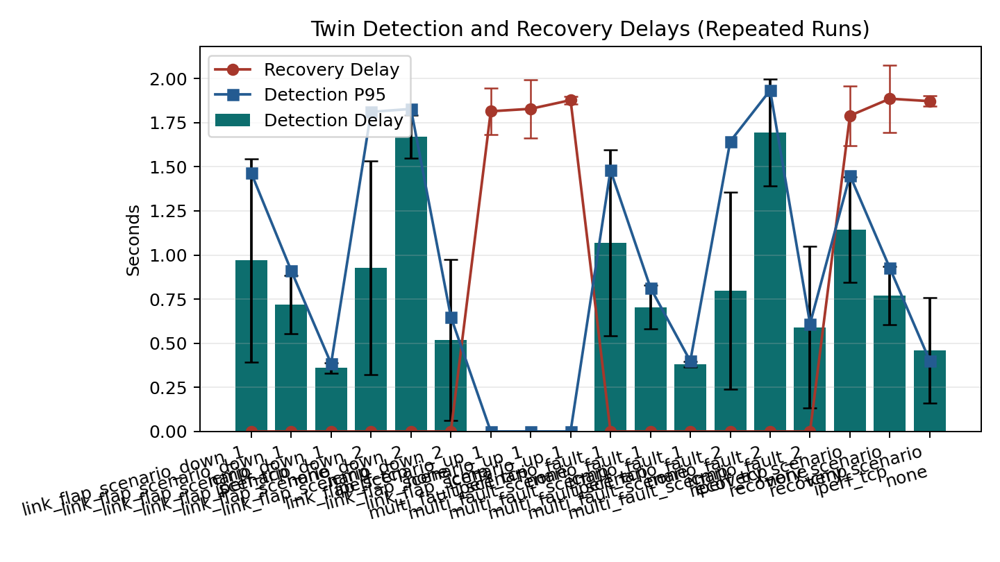
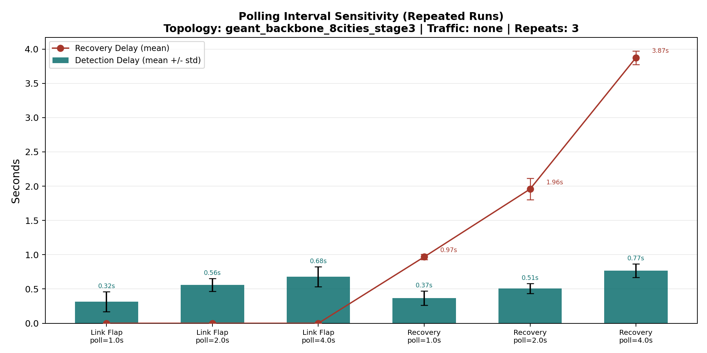
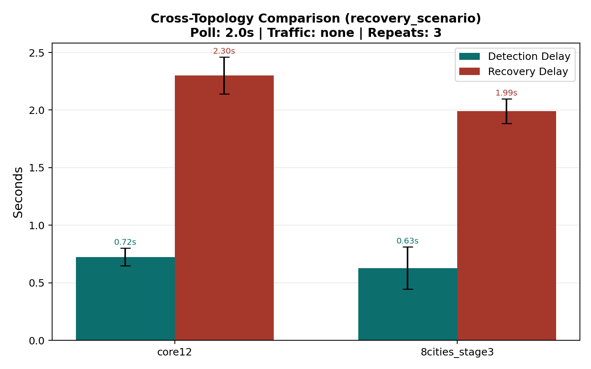

# 基于 REPEAT=10 主实验更新的网络数字孪生项目报告

## 摘要

本项目实现并验证了一个面向 SDN 场景的网络数字孪生原型。系统以 Mininet 和 Open vSwitch 作为网络仿真环境，以 Ryu 控制器作为统一观测入口，在孪生侧持续采集交换机、链路、主机、端口统计和流表信息，并构建结构化网络状态。通过对前后两次状态进行差分，系统能够生成链路故障、链路恢复、主机变化以及同步错误等结构化事件，并将实验过程导出为 CSV、JSON 和图表。

在最新一轮更新中，主实验矩阵已从 `repeat=3` 补跑为 `repeat=10`，以回应“样本数偏少、均值和标准差统计说服力不足”的问题。新的主结果表明：数字孪生能够稳定检测链路故障与恢复；背景流量会显著增加检测时延；轮询周期越长，恢复时延越高；观测退化场景会触发 `SYNC_ERROR`，而不会误报 `LINK_DOWN`。这些结果说明，该项目已经完成了一个具有基本工程闭环和较强实验可解释性的网络数字孪生 PoC。

## 1. 项目背景与目标

网络数字孪生的核心不是做一个网络状态展示页面，而是在数字空间中维护一份与物理网络对应的结构化镜像，并且能够持续更新、比较新旧状态、识别变化并记录事件。本项目的目标是完成这样一个研究型 PoC，并用实验回答以下几个问题：

1. 当物理网络中发生链路故障或恢复时，孪生系统能否正确检测？
2. 孪生系统的检测时延与恢复时延分别是多少？
3. 背景流量会不会影响检测效果？
4. 不同轮询周期会不会改变孪生同步性能？
5. 控制器观测异常时，系统会不会把“观测失败”误判成“链路断开”？

本项目明确定位为课程研究型实验原型，而不是生产级网络管理平台。因此实现优先级不是复杂功能堆叠，而是可运行、可解释、可复现和可用于报告写作。

## 2. 系统设计与实现

### 2.1 系统分层

系统由四层组成：

1. 网络仿真层  
   使用 Mininet 和 Open vSwitch 构建实验拓扑，并在脚本中执行链路 down/up、背景流量注入等动作。

2. 状态观测层  
   通过 Ryu REST API 获取网络状态，主要包括：
   - `/v1.0/topology/switches`
   - `/v1.0/topology/links`
   - `/v1.0/topology/hosts`
   - `/stats/switches`
   - `/stats/portdesc/<switch_id>`
   - `/stats/port/<switch_id>`
   - `/stats/flow/<switch_id>`

3. 孪生核心层  
   `src/twin/sync_engine.py` 负责构建 `NetworkState`，`src/twin/diff_engine.py` 负责做状态差分，`src/twin/event_engine.py` 负责把变化转成结构化事件。

4. 展示与实验层  
   `src/web/app.py` 提供 API 和基础页面，`src/twin/experiment_runner.py` 与 `src/twin/experiment_matrix.py` 负责编排实验并导出结果。

图 1. 系统整体架构。

图 2. 从物理网络变化到孪生状态构建与事件生成的数据流。

### 2.2 状态建模与事件机制

系统在每个同步周期中完成以下过程：

1. 通过 Ryu API 拉取交换机、链路、主机、端口统计和流表。
2. 在孪生侧构造结构化 `NetworkState`。
3. 将当前状态与上一轮状态比较。
4. 当链路状态发生变化时生成 `LINK_DOWN` / `LINK_UP`。
5. 当 API 拉取失败时生成 `SYNC_ERROR`。
6. 将当前状态、事件和实验记录写入导出文件。

因此，这个系统的核心价值不只是“看见当前网络”，而是“持续维护一个带历史差分能力的数字副本”。

## 3. 数据来源与实验依据

### 3.1 拓扑来源

本报告的主实验使用数据驱动拓扑：

- `data/topologies/geant_backbone_8cities_stage3.json`

该拓扑包含 8 个城市节点和 10 条主干链路，是当前项目的主实验基线。

扩展拓扑对比使用：

- `data/topologies/geant2012_core12.json`

这部分主要用于验证拓扑规模和结构复杂度变化后，孪生系统表现是否发生变化。

图 3. 主实验拓扑 `geant_backbone_8cities_stage3`。

### 3.2 运行时观测来源

实验中的交换机、链路、端口计数和流表信息都不是手工构造的，而是来自控制器 Ryu 的实时观测，再由孪生程序采集和整理。因此，实验结果的依据是“控制器当时实际看见的网络状态”。

### 3.3 结果文件来源

本报告主要使用以下结果文件：

- `data/exports/traffic_profile_repeat10.csv`
- `data/exports/traffic_profile_repeat10_summary.csv`
- `data/exports/traffic_profile_repeat10_manifest.json`
- `data/exports/observation_degradation_stage3_summary.csv`
- `data/exports/polling_full_matrix_summary.csv`
- `data/exports/p34_full_matrix_summary.csv`

其中，`traffic_profile_repeat10_*` 是昨天补跑的主实验矩阵结果。原始数据共 180 条记录，summary 共 18 条记录，已经比原来的 `repeat=3` 更适合做均值和标准差分析。

## 4. 实验设计

### 4.1 主实验基线

主实验采用以下固定配置：

- 拓扑：`geant_backbone_8cities_stage3`
- 控制器：`src.controller.topology_aware_switch`
- 同步方式：`polling`
- 轮询周期：`2.0s`

### 4.2 主实验场景

主实验矩阵包含三个场景：

1. `recovery_scenario`  
   先断开目标链路，再恢复，记录检测和恢复事件。

2. `link_flap_scenario`  
   让链路经历 `down -> up -> down` 抖动，观察多阶段事件是否都能被检测。

3. `multi_fault_scenario`  
   顺序触发两个链路故障，观察事件顺序和多故障检测能力。

### 4.3 背景流量配置

为了研究负载对孪生同步的影响，主实验在每个场景下都测试三种背景流量：

- `none`
- `icmp`
- `iperf_tcp`

### 4.4 REPEAT=10 补跑说明

原始主实验是 `repeat=3`。为了增强统计说服力，昨天对主实验矩阵进行了补跑，新的配置为：

- 场景数：3
- 流量配置：3
- 每组重复：10

因此总共完成：

- 9 个组合
- 180 条原始记录
- 18 条聚合 summary 记录

这个补跑是本次报告更新中最重要的新增内容。

## 5. 主实验结果：REPEAT=10

### 5.1 recovery_scenario

`recovery_scenario` 是最核心的主实验场景。根据 `traffic_profile_repeat10_summary.csv`，其结果如下：

| 背景流量 | detection mean | detection stddev | recovery mean | recovery stddev |
|---|---:|---:|---:|---:|
| none | 0.458 s | 0.299 s | 1.872 s | 0.030 s |
| iperf_tcp | 0.769 s | 0.166 s | 1.886 s | 0.191 s |
| icmp | 1.144 s | 0.299 s | 1.790 s | 0.170 s |

这个结果说明：

1. 无背景流量时检测最快。
2. 增加背景流量后，检测明显变慢。
3. 在这个场景中，背景流量对检测时延的影响比对恢复时延更明显。

### 5.2 link_flap_scenario

在 `link_flap_scenario_down_1` 中，第一阶段检测均值分别为：

| 背景流量 | detection mean | detection stddev |
|---|---:|---:|
| none | 0.360 s | 0.030 s |
| iperf_tcp | 0.719 s | 0.165 s |
| icmp | 0.970 s | 0.576 s |

在 `link_flap_scenario_up_1` 中，恢复均值分别为：

| 背景流量 | recovery mean | recovery stddev |
|---|---:|---:|
| none | 1.878 s | 0.023 s |
| iperf_tcp | 1.828 s | 0.165 s |
| icmp | 1.814 s | 0.131 s |

在 `link_flap_scenario_down_2` 中，第二次 down 的检测均值分别为：

| 背景流量 | detection mean | detection stddev |
|---|---:|---:|
| none | 0.518 s | 0.456 s |
| iperf_tcp | 1.669 s | 0.122 s |
| icmp | 0.926 s | 0.605 s |

这说明：

- 系统可以处理多阶段变化，而不是只检测第一次故障。
- 后续阶段时延通常高于第一阶段，说明前序事件和控制器收敛会影响后续检测。

### 5.3 multi_fault_scenario

`multi_fault_scenario` 的两阶段故障结果如下。

第一阶段故障 `fault_1`：

| 背景流量 | detection mean | detection stddev |
|---|---:|---:|
| none | 0.382 s | 0.017 s |
| iperf_tcp | 0.704 s | 0.125 s |
| icmp | 1.068 s | 0.527 s |

第二阶段故障 `fault_2`：

| 背景流量 | detection mean | detection stddev |
|---|---:|---:|
| none | 0.591 s | 0.459 s |
| iperf_tcp | 1.695 s | 0.302 s |
| icmp | 0.798 s | 0.559 s |

这个场景说明：

- 孪生系统可以在多故障场景下持续工作。
- 第一阶段的“无流量最快、背景流量更慢”趋势仍然成立。
- 第二阶段结果波动更大，说明复杂场景中时延不仅受流量影响，也受故障顺序和收敛过程影响。

图 4. 主实验矩阵在 `repeat=10` 下的结果图。

### 5.4 主实验总结

从 `repeat=10` 的主实验矩阵可以得到三个稳定结论：

1. 系统可以稳定检测故障与恢复。
2. 背景流量会显著增加检测时延。
3. `repeat=10` 后，这些趋势仍然成立，说明之前的结论不是偶然值。

## 6. 扩展实验结果

### 6.1 观测退化实验

`observation_degradation_stage3_summary.csv` 显示：

- detection mean：`0.381 s`

该实验的核心不是时延大小，而是语义正确性。系统在控制器观测失败时生成的是 `SYNC_ERROR`，而不是错误地产生 `LINK_DOWN`。这表明系统能够区分“观测异常”和“真实物理故障”。

### 6.2 polling interval 对比

`polling_full_matrix_summary.csv` 中最清晰的信号出现在 `recovery_scenario` 的恢复时延：

| polling interval | detection mean | recovery mean |
|---|---:|---:|
| 1 s | 0.369 s | 0.968 s |
| 2 s | 0.508 s | 1.958 s |
| 4 s | 0.768 s | 3.874 s |

图 5. polling 周期越长，恢复确认越慢。

这个结果几乎是单调变化的，因此是本项目最稳定的量化结论之一。

### 6.3 跨拓扑对比

`p34_full_matrix_summary.csv` 中，在 `recovery_scenario + none` 下：

| 拓扑 | detection mean | recovery mean |
|---|---:|---:|
| geant_backbone_8cities_stage3 | 0.628 s | 1.991 s |
| geant2012_core12 | 0.725 s | 2.300 s |

图 6. 更复杂拓扑下的检测与恢复通常更慢。

这说明随着拓扑规模和结构复杂度提升，孪生系统在状态获取和变化确认上的时延有上升趋势。

## 7. 讨论

### 7.1 昨天补跑主实验后的意义

昨天补跑的主实验有两个作用：

1. 回应了“`repeat=3` 统计强度不足”的问题。  
   现在主实验矩阵已经是 `repeat=10`，可以更有把握地讨论均值和标准差。

2. 验证了之前观察到的趋势是稳定的。  
   补跑后，主结论并没有被推翻，而是得到了进一步确认。

因此，这次更新并不是简单“多跑几次”，而是显著提升了主实验部分的可信度。

### 7.2 项目优势

本项目的优势主要体现在以下几个方面：

1. 实现了一个真正意义上的数字孪生闭环，而不仅是状态展示。
2. 实验链条完整，包含原始数据、summary、manifest 和图表。
3. 主实验已经具备较好的重复次数，能支持更稳妥的趋势分析。
4. 系统能够处理真实故障、恢复、多故障和观测退化等不同语义场景。

### 7.3 局限性

虽然主实验已经补到 `repeat=10`，但仍有以下限制：

1. 实验环境仍是 Mininet + Ryu 仿真，不代表真实运营网络。
2. 主实验拓扑虽然比 toy topology 更真实，但规模仍然有限。
3. polling 对比、跨拓扑对比等扩展实验的重复次数仍然较少，更适合做趋势性说明。
4. 控制器对比和同步模式对比代码已经实现，但当前本地工作区缺少完整汇总文件，因此未作为正式结论展开。

## 8. 结论

本项目完成了一个面向 SDN 场景的网络数字孪生 PoC。系统能够基于控制器观测持续构建结构化网络状态，并通过差分机制生成可分析的事件。实验表明：

1. 数字孪生能够稳定检测链路故障与恢复。
2. 背景流量会显著增加检测时延。
3. 轮询周期越长，恢复时延越高。
4. 观测退化会触发 `SYNC_ERROR`，而不会误报物理链路故障。
5. 更复杂拓扑下，检测与恢复通常更慢。

最关键的是，昨天补跑的 `repeat=10` 主实验矩阵已经把主结果从“初步趋势”提升到了“更有统计支撑的趋势”。因此，这一版报告比之前更适合作为提交给老师或继续加工成正式 TER 报告的基础版本。
